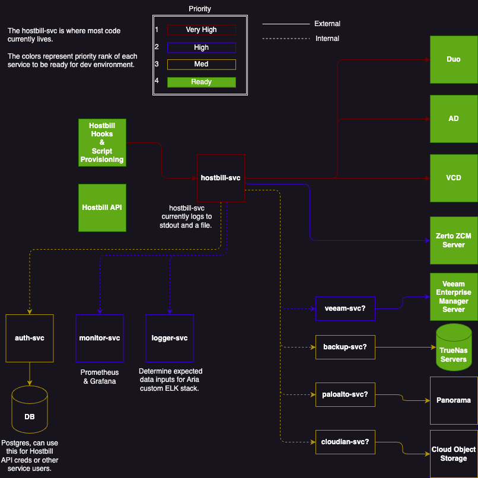

# Hostbill Service

This service will process requests for Veeam, Zerto, Palo Alto, Cloudian, etc.
As well as any extra products or services ordered through Hostbill.

The initial web server has been completed, and includes the following features.

- CLI flags for custom server configuration
- Structured logging
- Centralized error handling
- Middleware
- Security enhancements

Basic Veeam and Zerto pipelines have been connected to Hostbill.



## Routes

| Method | URL Pattern         | Handler            | Action                       |
| ------ | ------------------- | ------------------ | ---------------------------- |
| GET    | /api/v1/healthcheck | healthcheckHandler | Show application information |
| POST   | /api/v1/sso         | createSsoHandler   | Create SSO certificate       |
| PUT    | /api/v1/sso         | updateSsoHandler   | Update SSO certificate       |
| DELETE | /api/v1/sso         | deleteSsoHandler   | Delete SSO certificate       |
| POST   | /api/v1/zerto       | createVeeamHandler | Create Zerto organization    |
| PUT    | /api/v1/zerto       | updateVeeamHandler | Update Zerto organization    |
| DELETE | /api/v1/zerto       | deleteVeeamHandler | Delete Zerto organization    |
| POST   | /api/v1/veeam       | createVeeamHandler | Create Veeam storage         |
| PUT    | /api/v1/veeam       | updateVeeamHandler | Update Veeam storage         |
| DELETE | /api/v1/veeam       | deleteVeeamHandler | Delete Veeam storage         |

## Getting Started

There is a basic GitHub Actions CI/CD pipeline set up for this project. It
currently runs on pushes, and pull requests to the `main` branch. You can reach
it at `deployment-server.cloudkey.io`, it is an internal server.

### Local Install

To get started locally, make sure you have Git and Go installed, then pull the
repository.

```bash
git pull https://github.com/CloudKey-io/hostbill-svc
```

Or use Go `get`.

```bash
go get https://github.com/CloudKey-io/hostbill-svc
```

Follow the steps in [Run Project & Test](#run-project--test) to build, run, and
test.

### Run Project & Test

Next, build and run with the following command. Try adding the `-help` flag for
more information.

```bash
go run ./hostbill-svc/cmd/api
```

You should now be able to run `curl` commands against `localhost:4000`.

To test with services like Zerto, open another terminal prompt, `cd` into
`scripts` from the project root directory and run whatever script you would like
to test. Here is a currently working test example for Zerto.

```bash
sh order.sh hi 1 "United States" TX 12345
```

Running the script with incorrect arguments will return error messages like
below.

```bash
Usage: zerto.sh <name> <crm_identifier> <country> <state> <postal_code>
```

## Build for Remote Server

First, make code changes.

Then run the following, where `./test-api` is the name of the binary you are
building.

```bash
GOOS=linux GOARCH=amd64 go build -o ./test-api ./cmd/api
```

Change binary, user, and URL to fit your needs, with the following command.

```bash
scp test-api pwilliams@deployment-server.cloudkey.io:/home/pwilliams/
```

Then `ssh` into the Hostbill server and run `./api-test`, you might need to make
it binary with `chmod +x api-test`.

## Set Up TLS

If you need to create a development TLS certificate and key and have Go
installed, there is a handy tool to create self-signed certificates with the
`crypto/tls` package. From the project root folder, run the following.

```bash
mkdir tls
cd tls
```

Next, find the `generate_cert.go` tool's path, and run it from the `tls`
directory. Here is the path for MacOS, and probably Linux. The CLI flags are
there for convenience, copy/pasta away.

```bash
go run /usr/local/go/src/crypto/tls/generate_cert.go --rsa-bits=2048 --host=localhost
```

Then `cd` back into the root folder, build, and run the application.

```bash
cd ..
go run ./cmd/api
```

For more server config information, try running `go run ./cmd/api -help`.

You should now be able to run `curl` commands against `localhost:4000`.

## Conclusion

This project is a work in progress.
